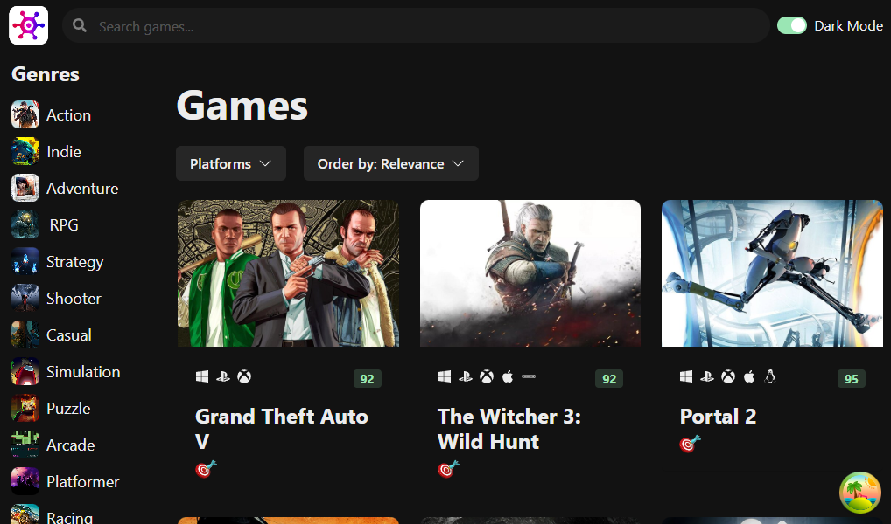

# Game Hub

This RAWG clone is a front end follow-along project coming from codewithmosh.com. It uses the Rawg API to for populating the UI with video game images, information, videos, etc. The user can search the database by name, filter and sort games by various criteria and navigate to a detail page for each game. Earlier/incomplete version is deployed at: https://game-hub-blue-zeta.vercel.app/

Notable features:
* Infinite scroll is implemented in combination with Tanstack/React-Query.
* Chakra library is used for styling.

### Screenshot

